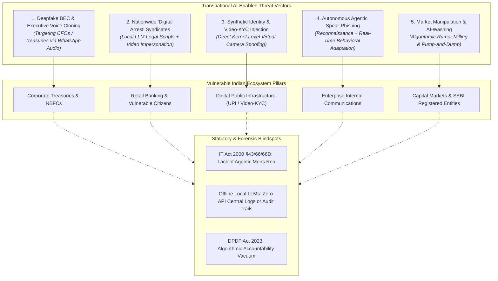
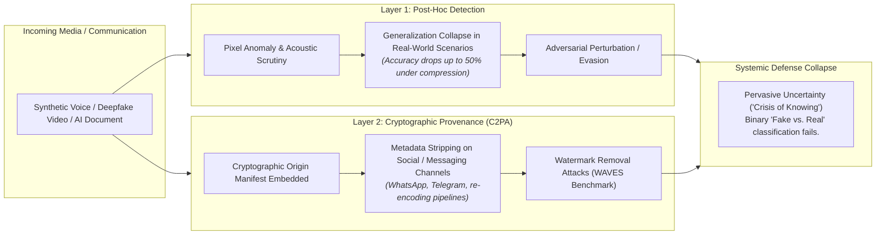
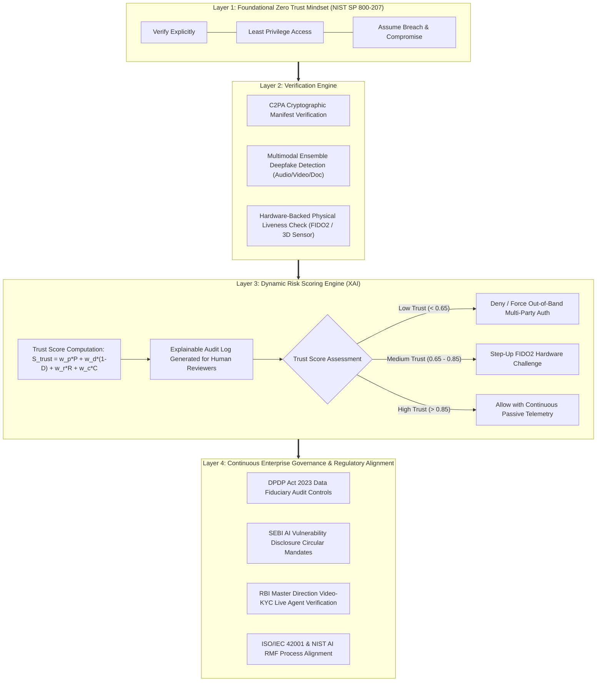
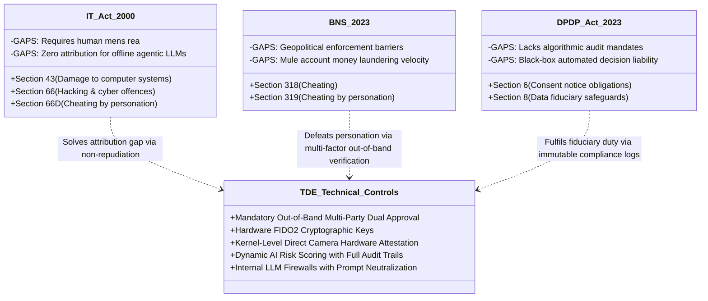

# Beyond Detection: Architecting Zero Trust Defenses Against AI-Enabled Cyber Threats in the Indian Enterprise Ecosystem

<p align="center">
  
  
  
  
  
</p>

---

## Authors & Institutional Affiliations

- **Aishika Sinha**  
  *Master of Laws, Cotton College*  

- **Prince Tigga**  
  *Department of Electronics and Communication Engineering, Tezpur University*  
  [tiggaprince403@gmail.com](mailto:tiggaprince403@gmail.com) | [GitHub Profile](https://github.com/useriswild7099)  

**Publication Date:** September 2026  
**Document Status:** Final Official Research Monograph  
**Official Document PDF:** [Download Publication PDF](./Beyond%20Detection%20-%20AI%20Cyber%20Threats%20and%20Zero%20Trust%20Defense%20(Final%20Research%20Paper).pdf)  
**Unabridged Full Text:** [Read Online Monograph (PAPER.md)](./PAPER.md)

---

## Executive Abstract

The rapid democratization of generative artificial intelligence between 2025 and 2026 has expanded the enterprise attack surface beyond traditional network perimeters into statistical model weights, inference pipelines, and biometric trust architectures. Modern organizations depend on algorithmic predictors, customer-facing generative copilots, and automated transaction pipelines—while transnational cyber adversaries weaponize identical models to execute scalable, psychologically nuanced attacks.

**India sits at the epicenter of this vulnerability curve:**
1. **Aggressive Digital Inclusion:** Mass digital public infrastructure (UPI, Aadhaar-enabled e-KYC, DigiLocker) alongside hundreds of millions of newly onboarded internet banking users has outpaced foundational cybersecurity literacy.
2. **Asymmetric Threats:** Transnational cybercrime syndicates target Indian corporate treasuries and citizens through deepfake Business Email Compromise (BEC), automated "digital arrest" extortion syndicates, software-injected Video-KYC spoofing, and agentic multi-stage spear-phishing.
3. **Statutory Lag:** Jurisprudential frameworks under the *Information Technology Act, 2000* (predicated on human *mens rea* and direct IP/server forensic footprints) and the *Digital Personal Data Protection Act, 2023* (DPDP) fail to accommodate autonomous local-LLM agentic execution or synthetic identity laundering.

This monograph synthesizes threat intelligence, regulatory vacuums, and defensive paradigms into an adapted **Trusted Digital Exchange (TDE)** framework. Rooted in **NIST SP 800-207 Zero Trust Architecture (ZTA)**, the TDE fuses cryptographic provenance (C2PA), multimodal detection ensembles, explainable dynamic risk scoring, and continuous institutional governance to build enterprise resilience in an environment where authenticity can never be assumed.

---

## Key Empirical Findings

### 1. Enterprise AI Adoption vs. Attack Surface Expansion

| Sector | AI Adoption Rate | Primary Use Cases | AI vs. Traditional Workflow Ratio | Dominant Attack Vector |
| :--- | :---: | :--- | :---: | :--- |
| **Technology & Software** | **92%** | Copilot code generation, IT support, automated CI/CD | 78% AI / 22% Traditional | Automated vulnerability discovery & malicious PR injection |
| **Financial Services & Banking** | **84%** | Fraud analytics, algorithmic trading, credit risk models | 65% AI / 35% Traditional | Video-KYC virtual camera injection & synthetic mule accounts |
| **Media, Marketing & Telecom** | **78%** | Generative creative assets, ad targeting, real-time analytics | 70% AI / 30% Traditional | Deepfake brand impersonation & credential stuffing |
| **E-Commerce & Retail** | **76%** | Dynamic pricing algorithms, recommendation engines | 60% AI / 40% Traditional | Agentic review manipulation & inventory hoarding botnets |
| **Healthcare & Pharma** | **67%** | Diagnostics imaging, discovery pipelines, clinical notes | 52% AI / 48% Traditional | Adversarial evasion & clinical data corruption |
| **Manufacturing & Industrial** | **52%** | Predictive telemetry, visual defect screening | 45% AI / 55% Traditional | SCADA inference poisoning & synthetic sensor tampering |

---

## Visual Architecture & System Blueprints

### Diagram 1: The AI-Enabled Threat Matrix Targeting Indian Enterprises



---

### Diagram 2: Failure Analysis of the Traditional Two-Layer Defense



---

### Diagram 3: The Trusted Digital Exchange (TDE) Framework Architecture



---

### Diagram 4: Statutory Crosswalk — Indian Cyber Law Gaps & Technical Mitigations



---

## Complete Table of Contents

The full unabridged paper is available directly in this repository in [`PAPER.md`](./PAPER.md):

1. **[Abstract](./PAPER.md#abstract)**
2. **[1. Introduction](./PAPER.md#1-introduction)**
3. **[2. The Enterprise Artificial Intelligence Adoption Landscape](./PAPER.md#2-the-enterprise-artificial-intelligence-adoption-landscape)**
   - Sectoral AI adoption benchmarks & workflow transition metrics
4. **[3. The Crisis of Trust: Synthetic Media as a Systemic Risk](./PAPER.md#3-the-crisis-of-trust-synthetic-media-as-a-systemic-risk)**
   - The societal and operational "crisis of knowing"
5. **[4. The AI-Enabled Threat Matrix Targeting Indian Enterprises](./PAPER.md#4-the-ai-enabled-threat-matrix-targeting-indian-enterprises)**
   - 4.1 Deepfake Business Email Compromise and Executive Impersonation
   - 4.2 The "Digital Arrest" Epidemic and Voice Cloning Extortion
   - 4.3 Synthetic Identity Fraud and Video-KYC Injection Attacks
   - 4.4 Autonomous Threat Actors: Agentic Language Models and Spear-Phishing
   - 4.5 Market Manipulation and AI-Washing
6. **[5. The Regulatory Vacuum in Indian Cyber Law](./PAPER.md#5-the-regulatory-vacuum-in-indian-cyber-law)**
   - 5.1 Mens Rea and Plausible Deniability in Agentic Crime
   - 5.2 The DPDP Act 2023: Algorithmic Accountability and Consent
   - 5.3 Sectoral Responses: SEBI and RBI
7. **[6. The Two-Layer Defense: Detection and Provenance](./PAPER.md#6-the-two-layer-defense-detection-and-provenance)**
   - 6.1 Detection Technologies and Their Limits
   - 6.2 Provenance Technologies and Their Limits
8. **[7. The AI Governance Gap: From Principles to Practice](./PAPER.md#7-the-ai-governance-gap-from-principles-to-practice)**
9. **[8. The Human Factor: Cognitive Offloading and Media Literacy](./PAPER.md#8-the-human-factor-cognitive-offloading-and-media-literacy)**
10. **[9. Zero Trust as the Unifying Paradigm](./PAPER.md#9-zero-trust-as-the-unifying-paradigm)**
11. **[10. A Proposed Synthesis: The Trusted Digital Exchange Framework for Indian Enterprises](./PAPER.md#10-a-proposed-synthesis-the-trusted-digital-exchange-framework-for-indian-enterprises)**
    - 10.1 Layer One – Foundational Mindset (Zero Trust)
    - 10.2 Layer Two – Verification Engine (Provenance + Detection)
    - 10.3 Layer Three – Intelligence Layer (Dynamic Trust Score with XAI)
    - 10.4 Layer Four – Governance Process
    - 10.5 Mapping the TDE to the Indian Regulatory Context
    - 10.6 Practical Enterprise Controls
12. **[11. Strategic Conclusions and Recommendations](./PAPER.md#11-strategic-conclusions-and-recommendations)**
13. **[References (1–30)](./PAPER.md#references)**

---

## Practical Enterprise Defense Checklist

Indian enterprise CISOs and engineering leaders can implement the following 8 critical controls defined in Section 10.6:

- [x] **Out-of-Band Multi-Party Authorization:** Mandate verified voice or cryptographic challenge over a secondary, physical communication channel for all fund disbursements exceeding defined thresholds (e.g., ₹5,00,000).
- [x] **Executive Challenge-Response Protocols:** Establish offline, out-of-band challenge phrases for senior leadership to pre-empt synthetic voice cloning and deepfake WhatsApp approvals.
- [x] **Hardware-Backed Cryptographic Authentication:** Deploy FIDO2 / WebAuthn physical security keys across all administrative and treasury workflows, completely eliminating phishable credentials and session-hijacking tokens.
- [x] **Anti-Injection Video-KYC Controls:** Require physical presentation-attack detection (PAD) coupled with direct hardware sensor telemetry to block virtual webcam injection drivers (OBS/ManyCam) during onboarding.
- [x] **Communication Anomaly Modeling:** Implement linguistic and behavioral baseline analysis to detect sudden shifts in urgency, tonal framing, or anomalous payment requests.
- [x] **Extended Detection & Response (XDR) for AI Agents:** Monitor automated API calls, high-volume endpoint queries, and off-hour script activities signaling unauthorized autonomous agentic reconnaissance.
- [x] **Internal Model Firewalls:** Position guardrail proxies between enterprise users and large language models to inspect outbound prompts, redact sensitive personal data, and strip adversarial injection patterns.
- [x] **Regulatory Alignment to ISO/IEC 42001 & NIST AI RMF:** Formalize governance documentation, automated compliance audit trails, and periodic red-team stress testing.

---

## Repository Contents

```
Beyond-Detection---AI-Cyber-Threats-and-Zero-Trust-Defense/
├── README.md                                                 # Flagship repository documentation and architectural synthesis
├── PAPER.md                                                  # Unabridged, complete 16-section research monograph
├── Beyond Detection - AI Cyber Threats and Zero Trust Defense (Final Research Paper).pdf # Pristine official publication PDF
├── Beyond Detection - AI Cyber Threats and Zero Trust Defense (Final Research Paper),claude.docx # Original formatted manuscript
├── CITATION.cff                                              # GitHub-native citation metadata (APA, BibTeX, RIS)
├── paper.bib                                                 # Standard BibTeX bibliography
├── LICENSE                                                   # Creative Commons Attribution 4.0 International (CC-BY-4.0)
└── .gitignore                                                # Selective ignore rules preserving pristine repository focus
```

---

## How to Cite

### BibTeX
```bibtex
@article{sinha_tigga_2026_beyond_detection,
  title        = {Beyond Detection: Architecting Zero Trust Defenses Against AI-Enabled Cyber Threats in the Indian Enterprise Ecosystem},
  author       = {Sinha, Aishika and Tigga, Prince},
  journal      = {Research Monograph on Cybersecurity and Cyber Law},
  year         = {2026},
  month        = {September},
  howpublished = {\url{https://github.com/useriswild7099/Beyond-Detection---AI-Cyber-Threats-and-Zero-Trust-Defense}},
  note         = {Master of Laws, Cotton College \& Department of Electronics and Communication Engineering, Tezpur University}
}
```

### APA
> Sinha, A., & Tigga, P. (2026). *Beyond Detection: Architecting Zero Trust Defenses Against AI-Enabled Cyber Threats in the Indian Enterprise Ecosystem*. Cotton College & Tezpur University. https://github.com/useriswild7099/Beyond-Detection---AI-Cyber-Threats-and-Zero-Trust-Defense

---

## License

This research paper, its architectural blueprints, and associated synthesis are licensed under the **Creative Commons Attribution 4.0 International License (CC BY 4.0)**. You are free to share, copy, adapt, and build upon this material for any purpose, provided appropriate attribution is given. See [LICENSE](./LICENSE) for details.
